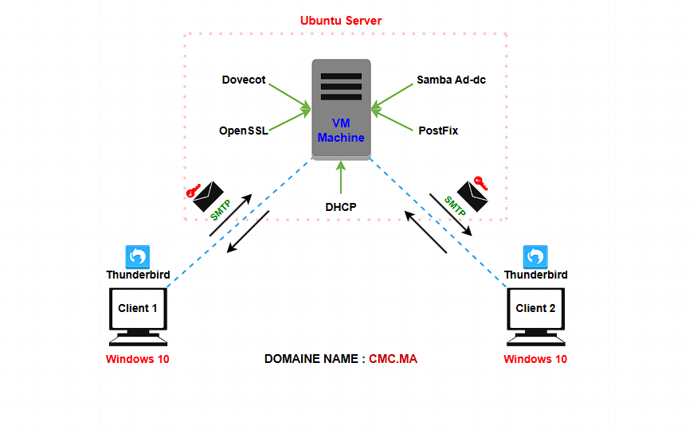
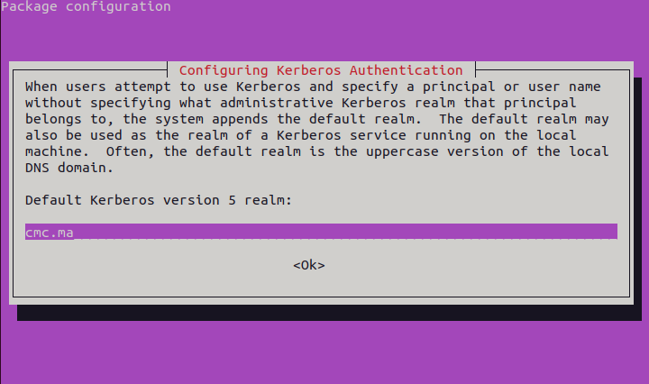
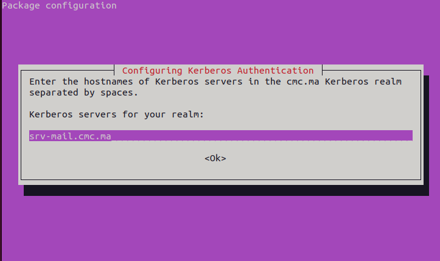
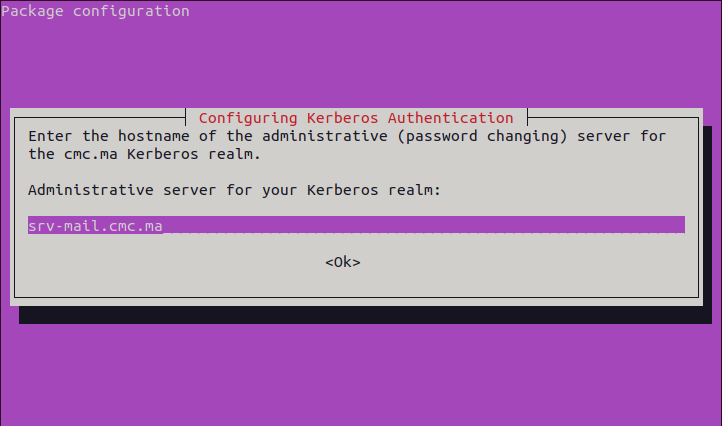
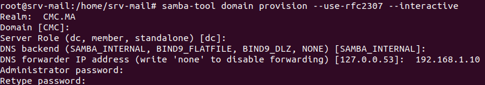
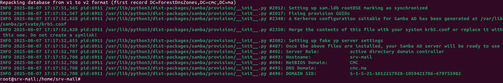
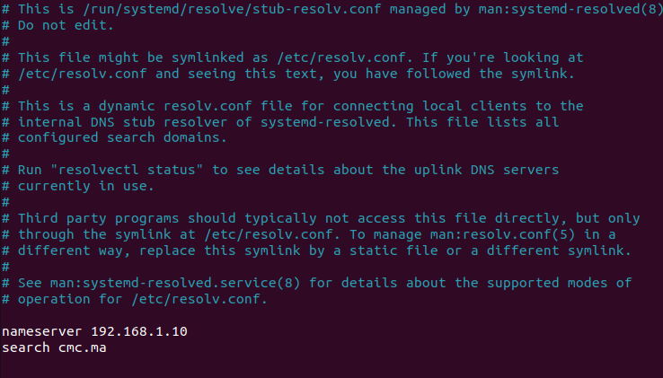

# 📧 Mail Server: Postfix + Dovecot + OpenSSL + Samba AD-DC
Secure mail server configuration on Ubuntu, integrating:

• Postfix for sending mail (SMTP)

• Dovecot for receiving mail (IMAP/POP3)

• Samba AD-DC for centralized user authentication

• TLS encryption with OpenSSL for secure communication

• DHCP server for dynamic IP management

## 🧪 Lab Topology


## 🛠 Step 1: Lab Environment Setup
🖥️ Virtual Machines
Use any virtualization platform you prefer: VirtualBox, VMware, KVM, etc.

Set up the following VMs:

| VM Name      | Operating System | Role                                           | IP Address   | Notes                                                                   |
| ------------ | ---------------- | ---------------------------------------------- | ------------ | ----------------------------------------------------------------------- |
| `Srvmail`    | Ubuntu (GUI)     | Mail Server, Samba AD-DC, OpenSSL, DHCP Server | 192.168.1.10 | Hosts Postfix, Dovecot, Samba AD-DC, OpenSSL (TLS), and DHCP Server |
| `computer_1` | Windows 10       | Client Machine                                 | 192.168.1.11 | Mail user client                                                        |
| `computer_2` | Windows 10       | Client Machine                                 | 192.168.1.12 | Mail user client                                                        |

## 📦 Step 2 : Install and config SAMBA-AD-DC

You Should be root :

### 👤 active root :
```bash
passwd root
```
Insert Your Password.

### 📦 install samba-ad-dc :
```bash
apt update

apt install -y samba winbind krb5-config smbclient dnsutils net-tools
```
• Insert <--> Your Domain exemple : `CMC.MA`



• Insert <--> hostname.domain exemple : `srv-mail.ofppt.ma`



• Insert <--> hostname.domain exemple : `srv-mail.ofppt.ma`



### 🧹 Transfer the main configuration:

```bash
mv /etc/samba/smb.conf /etc/samba/smb.conf.org
```

### 🏗️ Config Samba-AD-DC :

```bash
samba-tool domain provision --use-rfc2307 --interactive
```

• Insert <--> Your Domain exemple : `CMC.MA`

• Insert <--> IP (Dns) exemple : `192.168.1.10`

• Insert <--> Administrator Password exemple : `P@ssw0rd`



You should see: 



### 🔑 Copy Kerberos Configuration :

```bash
cp /var/lib/samba/private/krb5.conf /etc/
```

### 🌐 Configure DNS Resolution :

```bash
nano /etc/resolv.conf
```


### ⚠️ Disable Conflicting Services : 

```bash
systemctl disable --now smbd nmbd winbind systemd-resolved.service
```
You should see : 

```bash
root@srv-mail:/home/srv-mail# systemctl disable --now smbd nmbd winbind systemd-resolved.service
Synchronizing state of smbd.service with SysV service script with /lib/systemd/systemd-sysv-install.
Executing: /lib/systemd/systemd-sysv-install disable smbd
Synchronizing state of nmbd.service with SysV service script with /lib/systemd/systemd-sysv-install.
Executing: /lib/systemd/systemd-sysv-install disable nmbd
Synchronizing state of winbind.service with SysV service script with /lib/systemd/systemd-sysv-install.
Executing: /lib/systemd/systemd-sysv-install disable winbind
Removed /etc/systemd/system/dbus-org.freedesktop.resolve1.service.
Removed /etc/systemd/system/multi-user.target.wants/winbind.service.
Removed /etc/systemd/system/multi-user.target.wants/systemd-resolved.service.
Removed /etc/systemd/system/multi-user.target.wants/smbd.service.
Removed /etc/systemd/system/multi-user.target.wants/nmbd.service.
```

### 🚀 Start and Enable Samba Active Directory

```bash
systemctl unmask samba-ad-dc.service

systemctl enable --now samba-ad-dc.service
```

### 🔍 Check If Samba AD-DC Is Listening on Required Ports

```bash
netstat -antp | egrep 'smbd|samba'
```

You will see:
 
```bash
tcp        0      0 0.0.0.0:636             0.0.0.0:*               LISTEN      48915/samba: task[l 
tcp        0      0 0.0.0.0:389             0.0.0.0:*               LISTEN      48915/samba: task[l 
tcp        0      0 0.0.0.0:445             0.0.0.0:*               LISTEN      48907/smbd          
tcp        0      0 0.0.0.0:464             0.0.0.0:*               LISTEN      48923/samba: task[k 
tcp        0      0 0.0.0.0:49154           0.0.0.0:*               LISTEN      48911/samba: task[r 
tcp        0      0 0.0.0.0:49153           0.0.0.0:*               LISTEN      48911/samba: task[r 
tcp        0      0 0.0.0.0:49152           0.0.0.0:*               LISTEN      48905/samba: task[r 
tcp        0      0 0.0.0.0:53              0.0.0.0:*               LISTEN      48950/samba: task[d 
tcp        0      0 0.0.0.0:88              0.0.0.0:*               LISTEN      48923/samba: task[k 
tcp        0      0 0.0.0.0:139             0.0.0.0:*               LISTEN      48907/smbd          
tcp        0      0 0.0.0.0:135             0.0.0.0:*               LISTEN      48911/samba: task[r 
tcp        0      0 0.0.0.0:3269            0.0.0.0:*               LISTEN      48915/samba: task[l 
tcp        0      0 0.0.0.0:3268            0.0.0.0:*               LISTEN      48915/samba: task[l 
tcp6       0      0 :::636                  :::*                    LISTEN      48915/samba: task[l 
tcp6       0      0 :::389                  :::*                    LISTEN      48915/samba: task[l 
tcp6       0      0 :::445                  :::*                    LISTEN      48907/smbd          
tcp6       0      0 :::464                  :::*                    LISTEN      48923/samba: task[k 
tcp6       0      0 :::49154                :::*                    LISTEN      48911/samba: task[r 
tcp6       0      0 :::49153                :::*                    LISTEN      48911/samba: task[r 
tcp6       0      0 :::49152                :::*                    LISTEN      48905/samba: task[r 
tcp6       0      0 :::53                   :::*                    LISTEN      48950/samba: task[d 
tcp6       0      0 :::88                   :::*                    LISTEN      48923/samba: task[k 
tcp6       0      0 :::139                  :::*                    LISTEN      48907/smbd          
tcp6       0      0 :::135                  :::*                    LISTEN      48911/samba: task[r 
tcp6       0      0 :::3269                 :::*                    LISTEN      48915/samba: task[l 
tcp6       0      0 :::3268                 :::*                    LISTEN      48915/samba: task[l 
```

### 📡 Test Network Connectivity to the Domain Controller

```bash
ping srv-mail.ofppt.ma

ping cmc.ma
```

